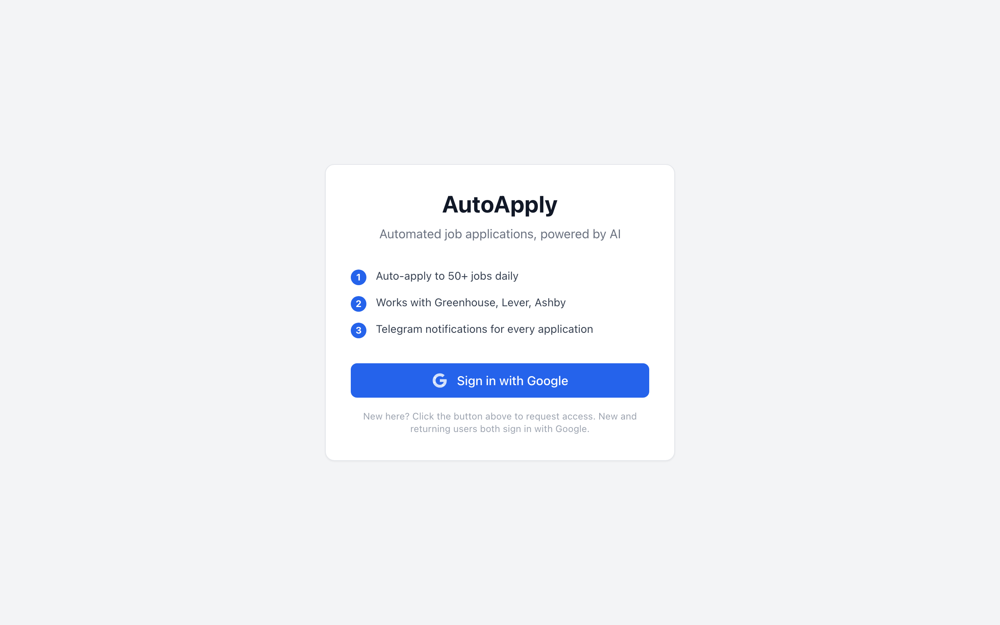
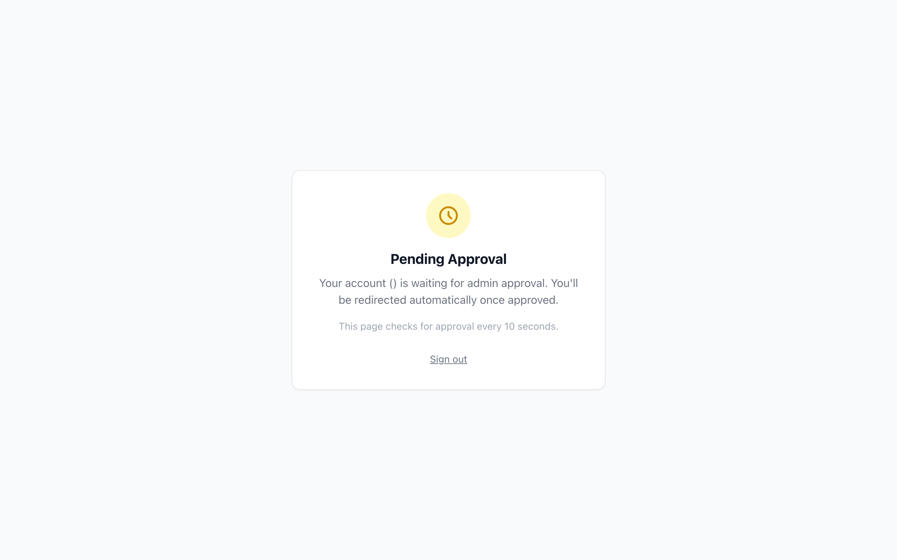

# AutoApply — Client Onboarding Guide

Get from zero to automated job applications in ~10 minutes.

---

## What You Need

- A **Google account** (for sign-in)
- Your **resume as a PDF**
- **10 minutes** of time
- (Optional) **Telegram** app for real-time notifications

That's it. No API keys, no subscriptions, no technical setup.

---

## Step 1: Sign In

Go to **[autoapply-web.vercel.app](https://autoapply-web.vercel.app)** and click **"Sign in with Google"**.



You'll see Google's standard consent screen. Select your Google account and authorize.


---

## Step 2: Wait for Approval

New accounts require admin approval. You'll see a "Pending Approval" page.



The page auto-checks every 10 seconds. Once approved, you'll be redirected automatically. This usually takes a few minutes during business hours.

> **Tip:** Message the admin to speed up approval.

---

## Step 3: AI Import (Fastest Method)

The onboarding wizard starts with **AI Import** — the fastest way to fill your profile.


**How it works:**

1. Copy the prompt shown on screen
2. Paste it into ChatGPT, Claude, or any AI assistant
3. Along with the prompt, paste your resume text or LinkedIn profile
4. The AI generates a JSON object with all your details
5. Paste that JSON back into AutoApply
6. Click **"Import"** — all profile fields auto-fill

This saves ~5 minutes of manual typing. You can still edit any field afterward.

---

## Step 4: Review Personal Info

After import, review your personal information:


| Field | Required | Notes |
|-------|----------|-------|
| First Name | Yes | As it appears on your resume |
| Last Name | Yes | |
| Phone | Yes | Include country code (+1 for US) |
| Email | Auto-filled | From your Google account |
| LinkedIn URL | Recommended | Full URL (https://linkedin.com/in/...) |
| GitHub URL | Optional | |
| Portfolio URL | Optional | |

---

## Step 5: Work & Education

Fill in your professional background:


| Field | Required | Notes |
|-------|----------|-------|
| Current Company | Yes | |
| Current Title | Yes | |
| Years of Experience | Yes | |
| School | Yes | Most recent degree |
| Degree | Yes | e.g., "Master of Science" |
| Major | Yes | e.g., "Computer Science" |
| Graduation Year | Yes | |
| Work Authorization | Yes | US Citizen, Green Card, H-1B, OPT, etc. |
| Sponsorship Needed | Yes | Yes/No |
| Gender | Optional | For EEO compliance (voluntary) |
| Race/Ethnicity | Optional | For EEO compliance (voluntary) |
| Veteran Status | Optional | For EEO compliance (voluntary) |
| Disability Status | Optional | For EEO compliance (voluntary) |

> **Note:** EEO fields are voluntary. Many applications ask these questions — if you fill them here, AutoApply handles them automatically.

---

## Step 6: Job Preferences

Tell AutoApply what jobs to look for:


**Target Roles** — Click chips to select (multi-select):
- AI Engineer
- ML Engineer
- Data Scientist
- NLP Engineer
- Computer Vision Engineer
- MLOps Engineer
- Research Scientist
- Applied Scientist
- Data Engineer
- Analytics Engineer
- Data Analyst
- ML Infrastructure
- GenAI Engineer

**Other settings:**
| Field | Purpose |
|-------|---------|
| Excluded Companies | Companies to never apply to (comma-separated) |
| Minimum Salary | Skip jobs below this threshold |
| Remote Only | Toggle on to skip on-site roles |
| Auto-Apply | Toggle on for fully automated applications (recommended) |

> **Auto-Apply ON (recommended):** The system applies to matching jobs automatically. You'll get Telegram notifications with screenshots of each submission.
>
> **Auto-Apply OFF:** Jobs appear on your dashboard for manual approval before applying.

---

## Step 7: Upload Resume

Upload your resume as a PDF:


- Drag and drop or click to browse
- PDF format only
- You can upload **multiple resumes** tagged for different role types (e.g., one for "AI Engineer" roles, another for "Data Scientist" roles)
- The system automatically selects the best resume based on the job title

---

## Step 8: Download & Run Setup Script

After completing onboarding, you'll land on the **Setup Complete** page with download buttons for your OS.

### macOS

```bash
chmod +x setup-mac.sh
./setup-mac.sh
```

### Windows (PowerShell as Administrator)

```powershell
Set-ExecutionPolicy Bypass -Scope Process
.\setup-windows.ps1
```

The script automatically:
- Installs Python 3.11+, Node.js 18+, OpenClaw CLI
- Installs Playwright browsers (Chromium)
- Clones the AutoApply repo
- Installs all Python and Node.js dependencies
- Prompts for your Supabase credentials
- Verifies everything is working

> **You will need:** OpenClaw Pro subscription ($20/mo) for browser automation. [Sign up here](https://openclaw.com/pricing).

---

## Step 9: Dashboard Tour

After setup, click "Go to Dashboard" to see the main dashboard:


**Stats Cards** (top row):
- **Applied Today** — applications submitted today
- **Total Applied** — all-time count
- **In Queue** — jobs waiting to be applied
- **Success Rate** — percentage of successful submissions

**Recent Applications** — your latest submissions with status, company, and role.

---

## Step 10: Explore Your Pages

### Jobs Page


Shows discovered jobs matching your preferences. Each row shows:
- Company, Role, Location
- ATS platform (Greenhouse, Ashby, Lever, etc.)
- Posted date
- Actions: **Approve** / **Skip**
- **Bulk Apply** button to queue all approved jobs

New jobs are discovered every 6 hours from public ATS APIs.

### Applications Page


Full history of your applications with:
- Status badges (Submitted, Failed, In Progress)
- Timestamps
- Click to expand and see the submission screenshot

### Settings Page


Seven tabs to manage your profile:

| Tab | What It Does |
|-----|-------------|
| **AI Import** | Re-import profile from ChatGPT/Claude at any time |
| **Personal Info** | Update name, phone, links |
| **Work & Education** | Update job, education, authorization |
| **Job Preferences** | Change target roles, exclusions, auto-apply toggle |
| **Resumes** | Upload/remove resumes, set default, tag by role |
| **Telegram** | Connect for real-time notifications |
| **Billing** | View tier, upgrade/downgrade subscription |

### Resumes Tab


Manage multiple resumes:
- See which resume is set as default
- Upload new resumes with target role tags
- Delete old resumes
- The worker automatically picks the best resume per job

### Telegram Settings


To connect Telegram:
1. Open Telegram and search for **@AutoApplyBot**
2. Send `/start` to the bot
3. The bot replies with your **Chat ID**
4. Paste the Chat ID into this settings page
5. Click **Save**

You'll receive notifications for:
- Each successful application (with screenshot)
- Failed applications (with error details)
- Daily summary at 8 PM

---

## Step 11: Admin Panel (Admin Only)


If you're an admin, you'll see an **Admin** link in the sidebar. The admin panel shows:
- Pending user approvals (Approve / Reject buttons)
- All approved users with their stats
- System-wide metrics (total apps, queue depth)
- Invite code management (legacy)

---

## What Happens Next?

Once you complete onboarding:

1. **Every 6 hours**, the scanner checks 370+ company job boards for new postings
2. Jobs matching your preferences are surfaced on your **Jobs** page
3. If **Auto-Apply is ON**, matching jobs are automatically queued
4. The worker fills out each application using your profile
5. You get a **Telegram notification** with a screenshot for each submission
6. All applications appear in your **Applications** page with full history

**Typical timeline:**
- Onboarding complete → First jobs discovered within 6 hours
- First auto-application submitted within 6-12 hours
- Ongoing: 5-50 applications per day depending on your tier and job availability

---

## FAQ

### Q: How does AutoApply fill out applications?
AutoApply uses browser automation (OpenClaw) to navigate real application forms, fill in your details, upload your resume, and submit. Each application gets a screenshot as proof.

### Q: What job boards does it support?
Currently: **Greenhouse** (271+ companies), **Ashby** (102+ companies), **Lever** (~7 companies), **SmartRecruiters** (growing list). Workday support is coming soon.

### Q: Can I control which jobs it applies to?
Yes. Set your target roles, excluded companies, and salary minimum in **Job Preferences**. With Auto-Apply OFF, you manually approve each job. With Auto-Apply ON, only matching jobs are queued.

### Q: What if an application fails?
Failed applications are logged with the error. The system retries up to 3 times for transient failures. You'll see the status on your Applications page and get a Telegram notification.

### Q: Is my data secure?
- All data stored in Supabase with Row Level Security (RLS) — you can only see your own data
- Resumes stored in a private storage bucket
- Google OAuth — we never see your Google password
- Gmail tokens encrypted at rest (Pro tier)

### Q: Can I pause applications?
Yes. Turn off **Auto-Apply** in Settings → Job Preferences. You can still manually approve individual jobs.

### Q: How do I cancel?
Go to Settings → Billing → Manage Subscription. You can downgrade to Free at any time.

---

## Troubleshooting

| Issue | Solution |
|-------|---------|
| Stuck on "Pending Approval" | Contact the admin — approval is manual |
| Google sign-in fails | Try a different browser or clear cookies |
| AI Import doesn't fill all fields | Some fields may not map — fill the rest manually |
| No jobs showing on Jobs page | Jobs refresh every 6 hours; check back later |
| Telegram not receiving notifications | Verify Chat ID is correct; make sure you sent `/start` to the bot |
| Resume upload fails | Ensure file is PDF and under 10 MB |

---

## Need Help?

Contact the admin or open an issue on GitHub.

---

## For Contributors: Capturing Screenshots

The authenticated page screenshots (onboarding, dashboard, settings, admin) require a logged-in session. To capture them:

1. Log into AutoApply in Chrome
2. Close Chrome completely (Cmd+Q)
3. Run: `python3 docs/capture-screenshots.py`

This uses your Chrome profile session to capture all pages and save them to `docs/images/`.
